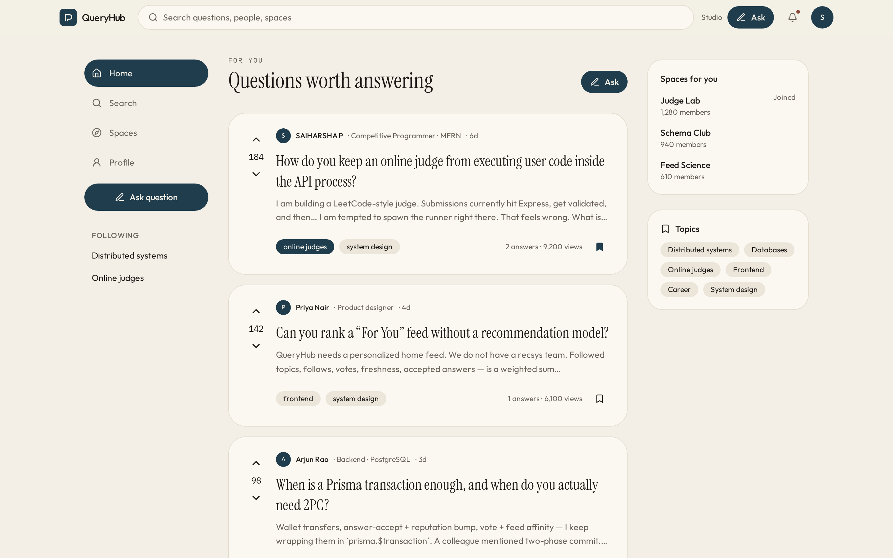
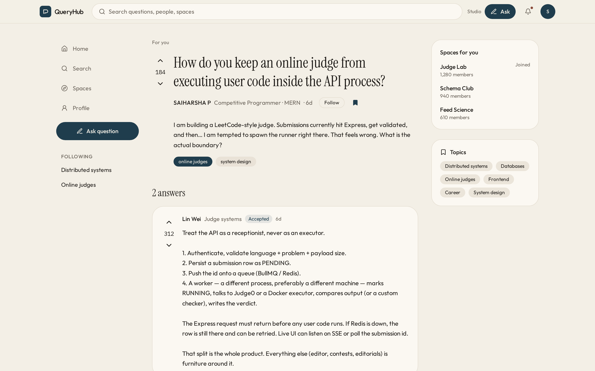
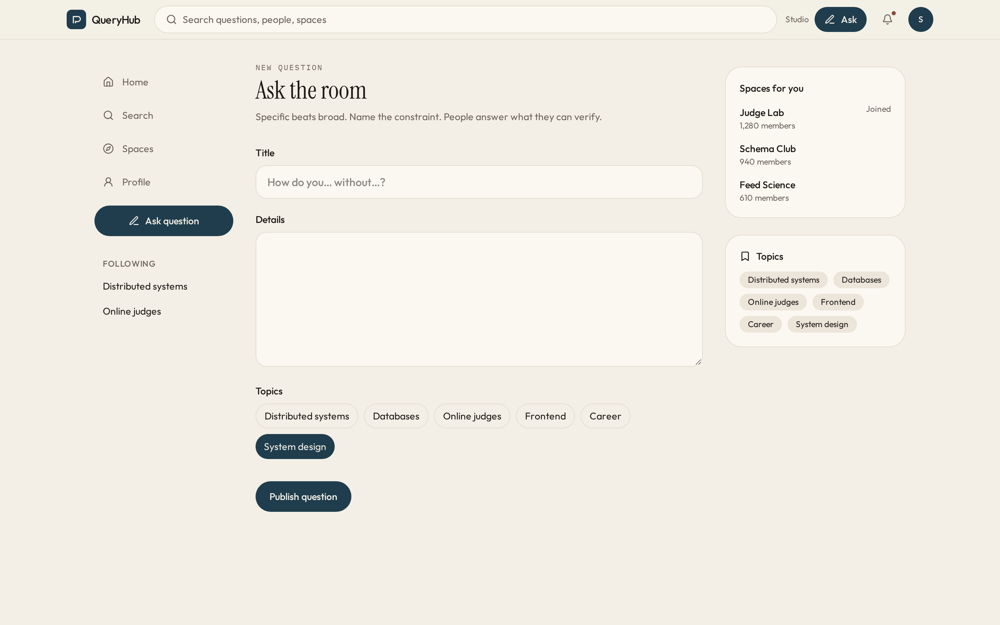
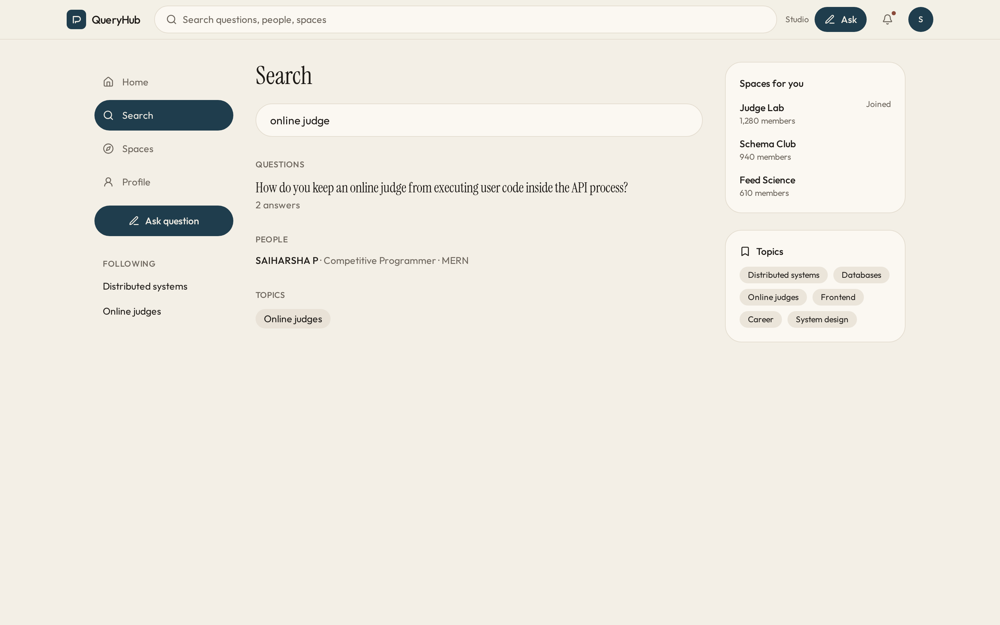
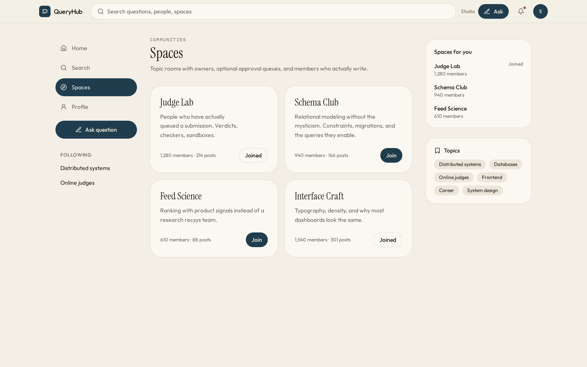
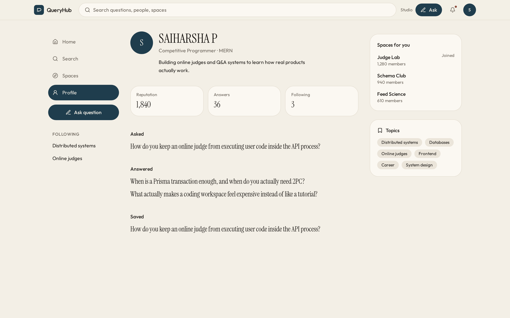

# QueryHub

[](https://github.com/Harsha41-dev/queryhub/actions/workflows/ci.yml)

I built QueryHub as a full-stack Q&A product. I wanted to understand the whole loop: ask a question, write an answer, vote, accept, follow a topic, and land on a home feed that is ranked from product signals I can explain.

It is inspired by Quora. I did not try to copy the UI. I wanted the domain to be real — questions, answers, Spaces, reputation, moderation, search, and the production checks that keep those writes safe.



This is the For You feed. Each card is a question with a vote control, the author credential, topics, and a bookmark. Ranking uses followed people, followed topics, votes, freshness, answer count, views, and whether an accepted answer exists. It is a weighted product, not a mystery model.

## Reading and answering

Opening a question shows the full thread: the asker, follow and bookmark, the body, and answers sorted with the accepted one first.



I can upvote or downvote, follow the author or a topic, bookmark the thread, and write an answer at the bottom. The question author can mark a best answer. Comments, reports, and markdown sit on the same object.

Asking is a short form on purpose. A specific title, a constraint in the body, and at most a few topics. People answer what they can verify.



## Search, Spaces, and profile

Search covers questions, people, and topics from one box.



Spaces are topic rooms with members, posts, and a join state. Owners can require approval before a question is published into the Space.



The profile is reputation, answers, follows, and the questions I asked, answered, or saved.



## Tech stack

| Area       | What I used                           |
| ---------- | ------------------------------------- |
| Frontend   | Next.js App Router, React, TypeScript |
| Styling    | Tailwind CSS                          |
| Backend    | Next.js Route Handlers                |
| Database   | PostgreSQL                            |
| ORM        | Prisma                                |
| Auth       | Auth.js / NextAuth                    |
| Validation | Zod                                   |
| Testing    | Vitest, Playwright                    |
| Tooling    | Docker, GitHub Actions                |

## What I implemented

**Q&A**

- Ask with a description, topic tags, and optional images
- Markdown answers with toolbar, preview, links, code, quotes, lists, and image upload
- Upvote, downvote, follow, bookmark, comment, and report
- Accepted / best answer, chosen by the asker
- Duplicate suggestions and a moderator merge flow

**Discovery**

- For You feed from followed topics, followed users, followed questions, topic affinity, votes, freshness, answer count, views, and accepted answers
- Hide, mute user, and not-interested-in-topic controls
- Answer requests, and suggested answerers from topics, prior answers, reputation, and credentials
- Search with autocomplete, filters, and ranking across questions, answers, topics, and people

**Trust**

- Profiles with bio, occupation, location, website, reputation, stats, and contribution history
- Credentials next to answers
- Badges for useful work, topic expertise, moderation, and top writers

**Spaces**

- Topic communities with create, join, roles, and invitations
- Optional approval queues and Space rules
- Owners and moderators can accept or reject submissions

**Notifications**

- In-app center for answers, comments, replies, mentions, follows, votes, accepted answers, Spaces, and moderation
- Email templates, preferences, and per-user / per-topic mutes
- Optional push subscriptions, a weekly digest job, and delivery audit records

**Moderation and production**

- Reports on questions, answers, comments, and profiles
- Moderator dashboard with notes, history, hide / restore / suspend / merge
- Lightweight spam signals for links, repeated text, promotional wording, and off-platform contact
- Environment validation, health and readiness endpoints, rate limits, structured logs
- Local and S3-compatible uploads, SEO metadata, sitemap, robots, Open Graph, and Q&A structured data

## Architecture

```text
app/          Pages, layouts, metadata, and API route handlers
components/   UI and feature components
lib/          Auth, validation, Prisma, search, feed, email, storage, security
prisma/       Schema, migrations, seed
scripts/      Env checks, security scans, notification jobs, load testing
tests/        Unit, integration, and Playwright e2e
docs/         Deployment, operations, load testing
```

Server pages fetch through helpers in `lib/query-data.ts`. Client components handle the interactive UI and call API routes. Routes validate with Zod, check the session and permissions, then write through Prisma. Multi-table writes use transactions. Push delivery and weekly digests run as scripts.

## Database

The schema models the parts of a real Q&A product:

- Content: `Question`, `Answer`, `Comment`, `Topic`
- Social graph: `UserFollow`, `TopicFollow`, `QuestionFollow`
- Interactions: `Vote`, `Bookmark`, `BookmarkCollection`
- Personalization: `UserTopicAffinity`, `QuestionView`, feed feedback
- Trust: `UserCredential`, `UserBadge`, `Report`, `ModerationAction`
- Communities: `Space`, `SpaceMember`, `SpaceQuestion`, `SpaceInvite`
- Notifications: `Notification`, `NotificationMute`, `NotificationDelivery`, `PushSubscription`, `AnswerRequest`
- Auth: `Account`, `Session`, password reset, email verification, email-change tokens

Indexes cover feed loading, search, notifications, moderation queues, follows, bookmarks, and Space queries.

## Security

- Passwords hashed with bcrypt
- Active sessions rechecked against the database
- Suspended or deleted users cannot keep a stale session
- Shared role checks for user, moderator, and admin routes
- Zod validation before every write
- Same-origin checks on unsafe mutations
- Rich text rendered safely — raw HTML is not trusted
- Uploads validated, resized, and stripped of metadata
- Rate limits on auth, posting, voting, reporting, uploads, search, follows, and settings
- Production startup refuses missing or unsafe environment config

## Testing

```powershell
npm run format:check
npm run lint
npm run typecheck
npm test
npm run build
npm audit --audit-level=moderate
npx prisma validate
npm run security:check
npm run security:client
```

Database integration tests are gated by `RUN_DATABASE_TESTS=1`. Playwright needs the app and PostgreSQL running.

## Running locally

Requirements: Node.js 20+, npm, Docker Desktop, Git.

```powershell
Copy-Item .env.example .env
npm ci
docker compose up -d postgres
npm run db:deploy
npm run db:seed
npm run dev
```

Open `http://localhost:3000`.

### Demo accounts

Password for every seed account: `DemoPass123!`

| Role      | Email                    |
| --------- | ------------------------ |
| User      | `maya@queryhub.dev`      |
| Moderator | `moderator@queryhub.dev` |
| Admin     | `admin@queryhub.dev`     |

The seed script is destructive. I only run it against a local or disposable database. Production seeding is blocked unless `ALLOW_PRODUCTION_SEED=true`.

## Deployment

For a public deploy I configure:

- Managed PostgreSQL with backups
- Secure `NEXTAUTH_SECRET` and `READINESS_TOKEN`
- HTTPS `APP_URL` and `NEXTAUTH_URL`
- `TRUST_PROXY=true` behind a platform proxy
- Upstash-compatible Redis for production rate limits
- Resend (or another provider) for transactional email
- S3-compatible storage for uploads

```powershell
npm run db:deploy
npm run build
npm run start
```

After deploy I check `/api/health` and `/api/ready` with `Authorization: Bearer READINESS_TOKEN`.

```powershell
$env:LOAD_TEST_BASE_URL="https://your-queryhub-domain.com"
npm run test:load
```

More detail: [docs/DEPLOYMENT.md](docs/DEPLOYMENT.md), [docs/OPERATIONS.md](docs/OPERATIONS.md), [docs/LOAD_TESTING.md](docs/LOAD_TESTING.md), [docs/PROJECT_NOTES.md](docs/PROJECT_NOTES.md).

## License

MIT. See [LICENSE](LICENSE).
