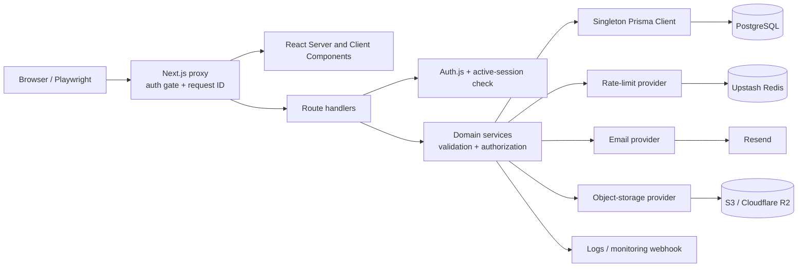

# QueryHub

QueryHub is a full-stack question-and-answer community built with Next.js, PostgreSQL, Prisma, and Auth.js. It includes content creation, voting, follows, bookmarks, search, profiles, notifications, moderation, administration, security controls, and responsive desktop/mobile interfaces.

The repository is designed as a portfolio-quality application and a production-minded reference implementation. Local development has no mandatory paid providers; production adapters are available for Neon, Upstash Redis, Resend, and S3-compatible storage.

## Product screenshots

| Knowledge feed | Administration |
| --- | --- |
|  |  |

<p align="center">
  
</p>

## Features

- Responsive knowledge feed and navigation for 320px through desktop layouts
- Credentials authentication, optional Google OAuth, JWT sessions, and database-backed stale-session invalidation
- `USER`, `MODERATOR`, and `ADMIN` authorization hierarchy with ownership checks
- Question, answer, and nested comment creation, editing, soft deletion, voting, bookmarks, and follows
- Transactional denormalized counters and duplicate-vote/follow constraints
- Search across questions, answers, topics, and users with PostgreSQL trigram indexes
- Profile, privacy, account, theme, and notification preferences
- In-app notifications, unread counts, mentions, and moderation notices
- Reporting, content hiding/restoration, suspension, role boundaries, and immutable audit records
- Live administration metrics and filterable, sortable, paginated tables with CSV export
- Safe Markdown subset, security headers, rate limiting, validation, and XSS-safe rendering
- Hashed, expiring, single-use email verification, reset, and email-change tokens
- Server-side avatar validation, re-encoding, metadata removal, replacement, and deletion
- Structured logging, correlation IDs, monitoring provider boundary, liveness, and protected readiness checks

### Implemented versus provider-dependent

| Capability | Local development | Production |
| --- | --- | --- |
| PostgreSQL | Docker Compose PostgreSQL 16 | Managed PostgreSQL required |
| Rate limiting | Process-local fixed-window provider | Upstash-compatible REST provider implemented and required |
| Email | Development logging provider | Resend REST adapter implemented and required |
| Avatar storage | Ignored `.local-uploads` directory | S3-compatible adapter implemented and required |
| Google sign-in | Disabled without credentials | Works when Google credentials and redirect URI are configured |
| Monitoring | Structured JSON logs | Optional generic authenticated webhook adapter |
| Browser push | Preference is stored; no delivery | Push provider is not implemented |

No external provider is contacted by the local test suite.

## Architecture



Server routes follow a consistent boundary: authenticate, identify the caller, rate limit, parse and validate, verify ownership/role, execute transactional persistence, and return a bounded result. Client claims about roles or ownership are never trusted.

### Authorization and moderation decisions

- Direct content editing is owner-only. Moderators use explicit moderation endpoints instead of impersonating authors.
- Moderators can act on normal users but not on other moderators or administrators. Administrator-only topic operations are checked again in route handlers.
- Report actions, hidden/restored content, suspensions, and moderator notes create `ModerationAction` records. Target foreign keys use `SetNull` where retaining the audit event matters.
- Protected layouts and mutation routes call `getActiveSession()`, which reloads the user. Deleted or suspended users are rejected even when their JWT has not expired.
- Every JWT carries a `sessionVersion`. Password resets, password changes, email confirmation, suspension changes, and account deletion increment the database value. A mismatch invalidates the stale JWT.
- IDOR attacks are prevented by loading the target record server-side and comparing its owner or role before an update/delete. Tests attempt cross-user edits and direct administrator requests.

### Data model

The normalized schema contains users and preferences, Auth.js accounts/sessions, questions, answers, three-level comments, topics and joins, polymorphic votes, follows, bookmarks, notifications, reports, media metadata, email tokens, and moderation actions. Database checks enforce exactly-one-target relationships, comment depth, self-follow prevention, and nonnegative counters. Unique constraints prevent duplicate votes, follows, answers, and bookmarks.

Search uses bounded Prisma queries plus GIN trigram indexes for question titles/descriptions, answers, topics, and public user fields. It is suitable for the current application scale, but not presented as a replacement for a ranked search platform.

## Technology

- Next.js 16 App Router, React 19, strict TypeScript, and Tailwind CSS
- PostgreSQL 16 and Prisma ORM
- Auth.js/NextAuth with credentials and optional Google OAuth
- Zod, React Hook Form, bcryptjs, Sharp, and AWS S3 SDK
- Vitest, Testing Library, Playwright, and Axe
- Docker, GitHub Actions, Dependabot, and Vercel-ready standalone output

## Repository layout

```text
app/                    Pages, layouts, and route handlers
components/             Feature and reusable UI components
lib/
  email/                Provider, templates, and token workflows
  storage/              Image processing and object-storage providers
  authorization.ts      Role and ownership rules
  env.ts                Strict server environment validation
  rate-limit.ts         Memory and Upstash provider implementations
  monitoring.ts         Error/performance provider boundary
prisma/
  schema.prisma         Database model
  migrations/           Reviewed production migrations
  seed.ts               Deterministic local/CI demo data
scripts/                 Environment, source-secret, and bundle checks
tests/                   Unit, integration, accessibility, security, and E2E
.github/                 CI and Dependabot configuration
```

## Local setup

Prerequisites: Node.js 20.9 or newer, npm, Docker Desktop, and Git.

```powershell
Copy-Item .env.example .env
node -e "console.log(require('crypto').randomBytes(32).toString('base64'))"
```

Replace the placeholder `NEXTAUTH_SECRET` in `.env`, then run:

```powershell
npm ci
docker compose up -d postgres
npx prisma migrate deploy
npm run db:seed
npm run dev
```

Open `http://localhost:3000`.

### Clean-database setup

The following destroys only the Docker Compose database volume:

```powershell
docker compose down --volumes --remove-orphans
docker compose up -d postgres
docker compose ps
npx prisma migrate deploy
npm run db:seed
npx prisma migrate status
```

Wait for `docker compose ps` to show `healthy` before applying migrations.

### Demo credentials

All local seed accounts use `DemoPass123!`.

| Role | Email |
| --- | --- |
| User | `maya@queryhub.dev` |
| Moderator | `moderator@queryhub.dev` |
| Administrator | `admin@queryhub.dev` |

Never run the seed command against production.

## Environment variables

`.env.example` is the authoritative template. `.env` and `.env.*` are ignored, except for the template.

| Variable | Required | Description |
| --- | --- | --- |
| `APP_ENV` | Yes | `development`, `test`, or strict `production` validation |
| `APP_URL` | Yes | Public application origin; HTTPS in production |
| `DATABASE_URL` | Yes | Runtime database URL; use Neon's pooled URL on Vercel |
| `DIRECT_URL` | Yes | Non-pooled URL used only by Prisma CLI migrations |
| `DATABASE_ADAPTER` | Yes | `native` locally/Docker, `neon` for the recommended serverless path |
| `NEXTAUTH_URL` | Yes | Canonical Auth.js origin |
| `NEXTAUTH_SECRET` | Yes | Generated signing secret; at least 43 characters in production |
| `GOOGLE_CLIENT_ID` / `GOOGLE_CLIENT_SECRET` | No | Must be supplied together |
| `EMAIL_PROVIDER` | Yes | `log` locally, `resend` in production |
| `EMAIL_FROM` | Yes | Verified sender in production |
| `EMAIL_REPLY_TO` | No | Optional reply address |
| `RESEND_API_KEY` | Production | Server-only Resend API key |
| `RATE_LIMIT_PROVIDER` | Yes | `memory` locally, `upstash` in production |
| `UPSTASH_REDIS_REST_URL` / `UPSTASH_REDIS_REST_TOKEN` | Production | Distributed limiter connection; never expose the standard token |
| `TRUST_PROXY` | Yes | Trust `x-forwarded-for` only behind Vercel/a controlled proxy |
| `STORAGE_PROVIDER` | Yes | `local` locally, `s3` in production |
| `MAX_UPLOAD_BYTES` | Yes | Server-side input limit; maximum allowed configuration is 10 MB |
| `S3_REGION`, `S3_BUCKET`, `S3_ENDPOINT` | Production | S3-compatible target (`auto` region for R2) |
| `S3_ACCESS_KEY_ID`, `S3_SECRET_ACCESS_KEY` | Production | Server-only bucket-scoped credentials |
| `S3_PUBLIC_BASE_URL` | Production | Public CDN/custom-domain base for avatar objects |
| `S3_FORCE_PATH_STYLE` | Yes | Provider compatibility flag; normally `false` for R2/AWS |
| `READINESS_TOKEN` | Yes | Bearer token for `/api/ready`; generated and 32+ characters in production |
| `LOG_LEVEL` | Yes | `debug`, `info`, `warn`, or `error` |
| `MONITORING_PROVIDER` | Yes | `log` or `webhook` |
| `MONITORING_WEBHOOK_URL` / `MONITORING_WEBHOOK_TOKEN` | Conditional | Optional authenticated monitoring collector |
| `ANALYTICS_ID` | No | Reserved server-side analytics identifier; no analytics SDK is included |

Production validation fails during build/start when mandatory providers, HTTPS origins, or generated secrets are missing. No server credential uses a `NEXT_PUBLIC_*` name.

## Commands and testing

```powershell
npm run format:check             # Prettier verification
npm run lint                     # ESLint
npm run typecheck                # strict TypeScript
npm test                         # unit tests; DB tests skip without the flag
$env:RUN_DATABASE_TESTS='1'; npm test
npm run build                    # Prisma generation + production Next build
npm run test:e2e                 # production-server Playwright suite
npm audit --audit-level=moderate
npm run security:check           # tracked env/credential/migration scan
npm run security:client          # scan built browser assets for server values
npx prisma validate
```

The browser suite covers registration/login/logout, session persistence, content CRUD, votes, follows, bookmarks, search, settings, avatar upload, notification state, privacy, direct-request IDOR attempts, role boundaries, suspension, moderation/audits, admin controls, runtime console errors, security headers, Axe checks, and layouts at 320, 375, 768, and 1280 pixels.

## Database migrations and recovery

- Create development migrations with `npm run db:migrate`; inspect the SQL before committing it.
- Apply checked-in migrations with `npm run db:deploy` (`prisma migrate deploy`).
- Production never uses `prisma db push` and never runs the seed automatically.
- `prisma.config.ts` points migration commands to `DIRECT_URL`; Prisma Client uses the pooled `DATABASE_URL`.
- The application reuses one Prisma Client per process during development. `DATABASE_ADAPTER=neon` uses the Neon serverless adapter on Vercel.
- CI rejects obvious `DROP TABLE`, `DROP COLUMN`, and `TRUNCATE TABLE` statements for manual review. Automation does not replace a human migration review.

Before a production migration:

1. Confirm the latest managed backup/PITR point and test restore access periodically.
2. Run the migration against a database branch or staging copy.
3. Deploy backward-compatible application code before destructive schema cleanup.
4. Run `npm run db:deploy` once as a release step, not concurrently in every web instance.
5. If a release fails, roll application code back. For a data/schema incident, restore to a new database branch/PITR point, validate it, then rotate `DATABASE_URL` and `DIRECT_URL`. Do not improvise a reverse migration against the only production copy.

The checked-in migrations are additive or constraint/index changes; none drops a table or column.

## Recommended production deployment

The documented path is **Vercel + Neon + Upstash Redis + Cloudflare R2 + Resend**. Equivalent managed services can implement the same interfaces, but the steps below describe this path completely.

### 1. Neon PostgreSQL

1. Create a Neon project and production database.
2. From the Connect dialog, copy both connection strings:
   - pooled hostname containing `-pooler` → `DATABASE_URL`
   - direct/non-pooled hostname → `DIRECT_URL`
3. Add `?sslmode=require` if it is not already present.
4. Set `DATABASE_ADAPTER=neon`.
5. Configure an appropriate history-retention/PITR window and rehearse branch restore.

Prisma's current Neon guidance recommends a pooled runtime URL and a direct CLI migration URL: [Prisma + Neon](https://docs.prisma.io/docs/orm/v6/overview/databases/neon) and [Neon connection pooling](https://neon.com/docs/connect/connection-pooling).

### 2. Upstash Redis

1. Create an Upstash Redis database near the Vercel region.
2. Copy its HTTPS REST URL and standard server token.
3. Set `RATE_LIMIT_PROVIDER=upstash`, `UPSTASH_REDIS_REST_URL`, and `UPSTASH_REDIS_REST_TOKEN`.
4. Set `TRUST_PROXY=true` on Vercel. Do not enable it when arbitrary clients can reach the Node server without a trusted proxy overwriting forwarding headers.

The limiter hashes identifiers before storing them, uses route-specific windows, returns `Retry-After` and `RateLimit-*` metadata, and fails closed in `APP_ENV=production`. See [Upstash REST API security](https://upstash.com/docs/redis/features/restapi).

### 3. Resend

1. Add and verify the sending domain in Resend.
2. Create a restricted production API key.
3. Set `EMAIL_PROVIDER=resend`, `RESEND_API_KEY`, and `EMAIL_FROM="QueryHub <noreply@your-domain>"`.
4. Optionally set `EMAIL_REPLY_TO`.

Verification, reset, security notice, and email-change messages include plain text and escaped HTML. See [Resend domain setup](https://resend.com/docs/dashboard/domains/introduction).

### 4. Cloudflare R2

1. Create a private R2 bucket.
2. Create a read/write API token scoped only to that bucket.
3. Attach a public custom domain or explicitly enable a public development URL for avatar reads.
4. Configure:

```text
STORAGE_PROVIDER=s3
S3_REGION=auto
S3_BUCKET=queryhub-production
S3_ENDPOINT=https://<ACCOUNT_ID>.r2.cloudflarestorage.com
S3_ACCESS_KEY_ID=<bucket-scoped-key>
S3_SECRET_ACCESS_KEY=<bucket-scoped-secret>
S3_PUBLIC_BASE_URL=https://media.example.com
S3_FORCE_PATH_STYLE=false
```

Uploads pass through the application, are decoded from their bytes, limited, rotated, resized to 512×512, and re-encoded as WebP before storage. SVG is rejected. Malware scanning is **not** implemented. See [Cloudflare R2 S3 credentials](https://developers.cloudflare.com/r2/get-started/s3/).

### 5. Vercel

1. Push this repository to a private or public GitHub repository and import it in Vercel, or install the CLI:

```powershell
npm install --global vercel
vercel login
vercel link
```

2. Add every production variable from `.env.example` in Project Settings → Environment Variables. Mark credentials/tokens sensitive. At minimum use:

```text
APP_ENV=production
APP_URL=https://queryhub.example.com
NEXTAUTH_URL=https://queryhub.example.com
DATABASE_ADAPTER=neon
EMAIL_PROVIDER=resend
RATE_LIMIT_PROVIDER=upstash
STORAGE_PROVIDER=s3
TRUST_PROXY=true
```

3. Generate independent secrets:

```powershell
node -e "console.log(require('crypto').randomBytes(32).toString('base64'))"
node -e "console.log(require('crypto').randomBytes(32).toString('base64url'))"
```

Use them for `NEXTAUTH_SECRET` and `READINESS_TOKEN` respectively.

4. Validate variables and deploy migrations with production values injected without writing them locally:

```powershell
vercel env ls production
vercel env run -e production -- npm run env:validate
vercel env run -e production -- npm run db:deploy
```

5. Deploy a preview, verify it, then deploy production:

```powershell
vercel deploy
vercel deploy --prod
vercel logs --environment production --level error --since 5m
```

Current Vercel CLI flow is documented at [Deploy from CLI](https://vercel.com/docs/projects/deploy-from-cli) and [Environment variables](https://vercel.com/docs/environment-variables).

6. Add the final domain and configure DNS/HTTPS:

```powershell
vercel domains add queryhub.example.com <vercel-project-name>
vercel domains inspect queryhub.example.com
```

Vercel provisions HTTPS after DNS validation. Update `APP_URL`, `NEXTAUTH_URL`, Google OAuth authorized origins, and the callback URI `https://queryhub.example.com/api/auth/callback/google`, then redeploy. HSTS is enabled only in the production build.

### Health and monitoring

- `GET /api/health` is an unauthenticated liveness check that returns only `{ "status": "ok" }`.
- `GET /api/ready` requires `Authorization: Bearer <READINESS_TOKEN>`. It checks PostgreSQL, rate limiting, storage, and email configuration but returns only `ready`/`not_ready`.
- Logs are newline-delimited JSON with sensitive-key redaction and generated `x-request-id` correlation IDs.
- `MONITORING_PROVIDER=webhook` sends bounded error/performance events to an authenticated HTTP collector. A Sentry SDK is not bundled; use the webhook bridge or add a dedicated adapter before claiming Sentry integration.
- Configure Vercel log drains/retention, uptime checks against `/api/health`, an authenticated readiness probe, database/Redis/storage alerts, and email-delivery alerts.

## Docker

Build the production image:

```powershell
docker build -t queryhub-production .
```

The image is multi-stage, contains standalone runtime files, runs as UID 1001, embeds no `.env`, and includes a liveness health check. Run migrations separately before starting application replicas.

For a local production-container smoke test, create an ignored `.env.container` using database host `postgres` rather than `localhost`, then run:

```powershell
docker compose up -d postgres
docker build -t queryhub-production .
docker run --rm --name queryhub-app --network intern3_default `
  --env-file .env.container -p 3000:3000 queryhub-production
```

For an actual production container, use `APP_ENV=production` and the managed provider variables. Inject secrets through the orchestrator; never use Docker `ARG` or `ENV` instructions for real credentials.

## CI and security automation

`.github/workflows/ci.yml` runs on pushes to `main` and pull requests with minimal read permissions. It installs with `npm ci`, validates environment/Prisma, scans tracked files, starts PostgreSQL 16, applies migrations, seeds CI fixtures, checks formatting/lint/types, runs unit and integration tests, audits dependencies, builds production, scans browser assets, installs Chromium, and runs Playwright. Browser artifacts upload only after failure.

Dependabot checks npm and GitHub Actions weekly. The lightweight security script rejects committed `.env` variants, common credential/private-key patterns, and obvious destructive migration statements. The post-build script searches browser assets for actual server-side values. GitHub's own secret scanning and branch protection should also be enabled after publication.

## Engineering tradeoffs and scaling limits

- Database validation of every protected session makes suspension and password invalidation immediate, at the cost of one indexed user read per protected request.
- JWTs avoid a server session table for normal requests; `sessionVersion` supplies explicit revocation.
- Denormalized counters improve feed reads but require transaction discipline and database nonnegative checks.
- The safe Markdown renderer deliberately supports a smaller feature set than CommonMark.
- Search uses PostgreSQL trigram matching and bounded queries. At millions of users/content rows, add a weighted `tsvector` or dedicated search index, an indexing queue/outbox, cursor pagination, and relevance telemetry.
- Question detail currently returns at most 50 answers and 100 comments. Large discussions need incremental cursor pagination.
- Admin tables paginate a bounded operational window. Large installations should move filtering/sorting/pagination fully into cursor-based server queries.
- Server-side image re-encoding gives a strong validation boundary but consumes function memory/CPU. At high volume, use a signed quarantine upload followed by an isolated processing worker before promoting objects public.
- Notifications are synchronous database writes. At high volume, publish domain events to a durable queue and generate fan-out asynchronously.
- Multi-region scale requires regional database strategy, shared rate limiting, CDN-backed media, background jobs, cache invalidation, and formal SLO/incident operations; this repository does not claim that scale today.

## Security considerations

- Passwords use bcrypt cost 12. Raw recovery/verification tokens are random, emailed once, SHA-256 hashed in PostgreSQL, expiring, and atomically claimed.
- Prisma parameterization and Zod validation bound inputs and prevent mass assignment.
- Plain content is React-escaped; raw HTML is never interpreted by the Markdown renderer.
- CSP, HSTS in production, clickjacking, MIME sniffing, referrer, and browser-permission headers are set centrally.
- CSV cells that could be spreadsheet formulas are escaped.
- Forwarded IP headers are ignored unless `TRUST_PROXY=true`; on an untrusted production topology anonymous clients intentionally share a restrictive fallback key.
- Upstash, Resend, S3, OAuth, database, readiness, and monitoring credentials remain server-only.
- Uploaded images are validated by decoded format rather than extension. No malware scanner is present.
- Run `npm audit`, rotate provider credentials, maintain backups, review migrations, and retain moderation/security logs according to the deployment's threat model and legal requirements.

## Troubleshooting

- **Environment validation failed:** compare `.env` with `.env.example`; production intentionally rejects local providers and HTTP origins.
- **Prisma cannot connect:** confirm Docker health, URL encoding, SSL options, and that `DATABASE_URL` is pooled while `DIRECT_URL` is direct on Neon.
- **Migration drift:** run `npx prisma migrate status`; do not repair production with `db push`.
- **Generated client mismatch:** run `npm run db:generate` after schema changes.
- **OAuth callback error:** verify the exact HTTPS origin and `/api/auth/callback/google` URI.
- **429 responses:** inspect `Retry-After`; verify Upstash health and proxy configuration rather than disabling limits.
- **Readiness returns 404:** send the bearer readiness token. The endpoint intentionally hides its existence from unauthenticated callers.
- **Local avatar is missing:** ensure `.local-uploads` is writable and use the same `APP_URL` used when the avatar was stored.
- **Docker cannot reach PostgreSQL:** containers use the Compose service name `postgres`, not `localhost`.
- **Port 3000 is busy:** stop the existing Node/container process or map another host port.

## Publishing to GitHub

After the verified initial commit, create an empty GitHub repository without generated history, then run:

```powershell
git remote add origin https://github.com/<owner>/<repository>.git
git push -u origin main
```

Enable branch protection, required CI checks, Dependabot alerts, and GitHub secret scanning. No remote repository is created or tested by this local preparation task.

## License

QueryHub is available under the [MIT License](LICENSE).
